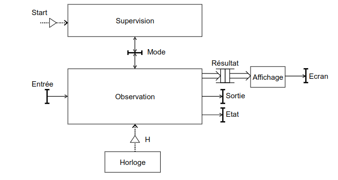

## Contexte
Ce projet est un exercice universitaire réalisé à Nantes Université en 3ème année du cycle d'ingénieur spécialisé en Électronique et Technologies Numériques.

## Résumé du projet
Le projet consiste à réaliser une application temps-réel qui mesure le temps de réaction.
Il s’agit d’implanter une application simple permettant de mesurer le temps de réaction d’une personne (Utilisateur) et mettant en œuvre différentes entrées/sorties disponibles sur la carte SAMD21.
La structure fonctionnelle de l'application est donnée ci-dessous.

In fine, les résultats d'une session sont affichés sur un écran.

## A propos
Le rapport est disponible dans le dossier principal.
Seuls les fichiers `main.c` et `FreeRTOSConfig.h` sont présentés dans ce répertoire.
Le logiciel utilisé est Microchip Studio.
La cible matérielle est une carte SAMD21XPLAINEDPRO et une carte d'extension OLED1XPLAINEDPRO équipée d'un écran, de 3 LEDs et de 3 boutons.
La cible logicielle est l'exécutif temps-réel FreeRTOS.